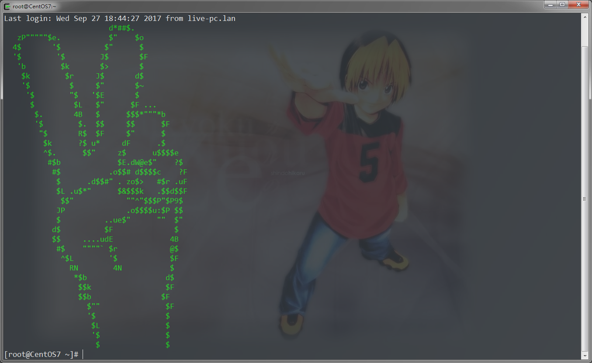

## 说明
SSH远程登录显示个性化界面

## 操作
```bash
curl https://raw.githubusercontent.com/Koogoo/motd/master/motd >> /etc/motd
```
### 或
```bash
wget https://raw.githubusercontent.com/Koogoo/motd/master/motd  -O - >> /etc/motd
```

## 截图

